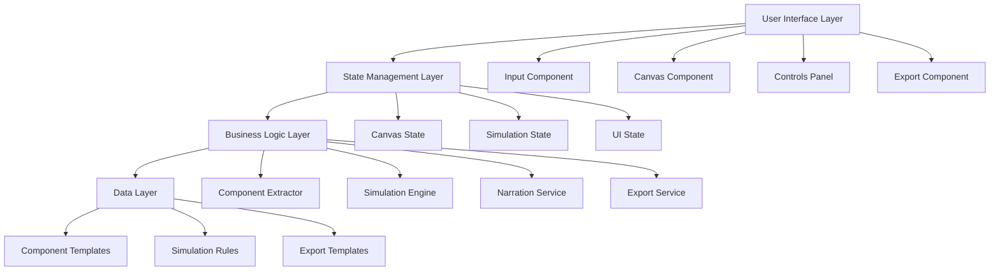

# Design Document

## Overview

CanvasTutor is architected as a single-page React application that combines an intuitive drag-and-drop interface with real-time system simulation. The application uses React Flow for canvas management, shadcn/ui for consistent styling, and a custom simulation engine for educational feedback. The design emphasizes modularity, testability, and beginner-friendly interactions.

## Architecture

### High-Level Architecture



### Technology Stack

- **Frontend Framework**: React 18 with TypeScript
- **Canvas Library**: React Flow (@xyflow/react) for drag-and-drop canvas
- **UI Components**: shadcn/ui for consistent, accessible components
- **State Management**: React useState/useContext for local state
- **Styling**: Tailwind CSS with shadcn/ui theming
- **Animation**: CSS transitions and React Flow's built-in animations
- **Testing**: Vitest for unit tests, React Testing Library for component tests
- **Build Tool**: Vite for fast development and building

## Components and Interfaces

### Core Components

#### 1. App Component
```typescript
interface AppState {
  currentStep: 'input' | 'canvas' | 'simulation';
  userInput: string;
  components: ComponentCard[];
  canvasNodes: Node[];
  canvasEdges: Edge[];
  simulationState: SimulationState;
}
```

#### 2. InputPrompt Component
```typescript
interface InputPromptProps {
  onSubmit: (input: string) => void;
  isLoading: boolean;
}

interface UserInput {
  description: string;
  goal?: string;
  features?: string;
  techPreferences?: string;
}
```

#### 3. ComponentExtractor Service
```typescript
interface ComponentCard {
  id: string;
  label: string;
  description: string;
  techOptions: [string, string]; // [managed, diy]
  category: 'frontend' | 'backend' | 'database' | 'auth' | 'storage' | 'other';
}

interface ExtractorResponse {
  components: ComponentCard[];
  confidence: number;
  suggestions: string[];
}
```

#### 4. Canvas Component
```typescript
interface CanvasProps {
  components: ComponentCard[];
  nodes: Node[];
  edges: Edge[];
  onNodesChange: (changes: NodeChange[]) => void;
  onEdgesChange: (changes: EdgeChange[]) => void;
  onConnect: (connection: Connection) => void;
  onNodeDrop: (component: ComponentCard, position: XYPosition) => void;
}

interface CustomNodeData {
  componentId: string;
  label: string;
  description: string;
  techChoice: 'managed' | 'diy';
  metrics: NodeMetrics;
}

interface NodeMetrics {
  responsiveness: number; // 0-100
  traffic: number; // current traffic
  cost: number; // monthly cost estimate
  reliability: number; // 0-100
}
```

#### 5. ControlsPanel Component
```typescript
interface ControlsState {
  traffic: number; // 0-1000
  instances: number; // 1-10
  cache: 'off' | 'small' | 'large';
  vendor: 'managed' | 'diy';
}

interface ControlsPanelProps {
  controls: ControlsState;
  onControlChange: (key: keyof ControlsState, value: any) => void;
  onPlaySimulation: () => void;
  isSimulating: boolean;
}
```

#### 6. SimulationEngine
```typescript
interface SimulationEngine {
  calculateMetrics(
    nodes: Node[],
    edges: Edge[],
    controls: ControlsState
  ): Promise<SimulationResult>;
  
  animateDataFlow(edges: Edge[]): void;
  
  generateNarration(
    previousState: SimulationState,
    newState: SimulationState,
    changedControl: string
  ): string;
}

interface SimulationResult {
  nodeMetrics: Map<string, NodeMetrics>;
  systemMetrics: {
    totalCost: number;
    averageResponseTime: number;
    reliability: number;
  };
  recommendations: string[];
}
```

### Service Interfaces

#### Component Extraction Service
```typescript
class ComponentExtractorService {
  async extractComponents(userInput: string): Promise<ComponentCard[]> {
    // Parse user input and generate relevant components
    // Use predefined templates and rules-based logic
  }
  
  private parseStructuredInput(input: string): UserInput {
    // Parse "goal / features / tech" format
  }
  
  private generateFromTemplate(parsedInput: UserInput): ComponentCard[] {
    // Generate components based on common patterns
  }
}
```

#### Simulation Service
```typescript
class SimulationService {
  calculateNodeMetrics(
    node: Node,
    incomingTraffic: number,
    controls: ControlsState
  ): NodeMetrics {
    // Deterministic calculations based on component type and controls
  }
  
  simulateDataFlow(nodes: Node[], edges: Edge[]): FlowAnimation[] {
    // Calculate token movement paths and timing
  }
  
  generateCostEstimate(nodes: Node[], controls: ControlsState): number {
    // Simple cost model based on component types and scaling
  }
}
```

## Data Models

### Component Templates
```typescript
const COMPONENT_TEMPLATES: Record<string, ComponentTemplate> = {
  auth: {
    label: 'Authentication',
    description: 'Handles user sign-in and sessions',
    techOptions: ['Firebase Auth', 'Node.js + JWT'],
    baseMetrics: { responsiveness: 85, cost: 20, reliability: 95 },
    scalingFactors: { traffic: 0.1, instances: 0.8 }
  },
  database: {
    label: 'Database',
    description: 'Stores and retrieves application data',
    techOptions: ['MongoDB Atlas', 'PostgreSQL + Docker'],
    baseMetrics: { responsiveness: 70, cost: 50, reliability: 90 },
    scalingFactors: { traffic: 0.2, instances: 0.6 }
  }
  // ... more templates
};
```

### Simulation Rules
```typescript
interface SimulationRules {
  trafficImpact: {
    responsiveness: (traffic: number) => number;
    cost: (traffic: number) => number;
  };
  
  instanceScaling: {
    responsiveness: (instances: number) => number;
    cost: (instances: number) => number;
  };
  
  cacheEffects: {
    off: { responsiveness: 1.0, cost: 1.0 };
    small: { responsiveness: 1.2, cost: 1.1 };
    large: { responsiveness: 1.5, cost: 1.3 };
  };
  
  vendorMultipliers: {
    managed: { responsiveness: 1.1, cost: 1.4, reliability: 1.2 };
    diy: { responsiveness: 0.9, cost: 0.7, reliability: 0.8 };
  };
}
```

## Error Handling

### Error Boundaries
- **ComponentExtractorError**: Handles failures in component generation
- **SimulationError**: Manages simulation calculation failures
- **CanvasError**: Catches React Flow rendering issues

### Error Recovery Strategies
```typescript
interface ErrorRecovery {
  componentExtraction: {
    fallback: () => ComponentCard[]; // Return default components
    retry: (input: string) => Promise<ComponentCard[]>;
  };
  
  simulation: {
    fallback: () => SimulationResult; // Return safe default values
    gracefulDegradation: boolean; // Continue with partial results
  };
  
  canvas: {
    resetToLastGoodState: () => void;
    clearAndRestart: () => void;
  };
}
```

### User-Friendly Error Messages
```typescript
const ERROR_MESSAGES = {
  COMPONENT_EXTRACTION_FAILED: "I couldn't understand your description. Try describing what your app should do in simpler terms.",
  SIMULATION_TIMEOUT: "The simulation is taking longer than expected. Let me try with simpler calculations.",
  CANVAS_RENDER_ERROR: "Something went wrong with the canvas. Let me refresh it for you.",
  EXPORT_FAILED: "I couldn't generate the export file. Please try again or contact support."
};
```

## Testing Strategy

### Unit Testing
```typescript
// Simulation Engine Tests
describe('SimulationEngine', () => {
  test('calculates basic metrics correctly', () => {
    const result = simulationEngine.calculateMetrics(mockNodes, mockEdges, mockControls);
    expect(result.nodeMetrics.get('auth').responsiveness).toBeGreaterThan(0);
  });
  
  test('applies traffic scaling correctly', () => {
    const lowTraffic = simulationEngine.calculateMetrics(nodes, edges, { traffic: 10 });
    const highTraffic = simulationEngine.calculateMetrics(nodes, edges, { traffic: 1000 });
    expect(highTraffic.systemMetrics.totalCost).toBeGreaterThan(lowTraffic.systemMetrics.totalCost);
  });
});

// Component Extractor Tests
describe('ComponentExtractor', () => {
  test('extracts components from simple description', async () => {
    const components = await extractor.extractComponents('I want to build a blog');
    expect(components).toHaveLength(3);
    expect(components.map(c => c.label)).toContain('Database');
  });
});
```

### Integration Testing
```typescript
// Canvas Integration Tests
describe('Canvas Integration', () => {
  test('drag and drop creates node', () => {
    render(<App />);
    const component = screen.getByText('Authentication');
    const canvas = screen.getByTestId('canvas');
    
    fireEvent.dragStart(component);
    fireEvent.drop(canvas);
    
    expect(screen.getByText('Auth')).toBeInTheDocument();
  });
});
```

### End-to-End Testing
```typescript
// User Journey Tests
describe('Complete User Journey', () => {
  test('user can create, simulate, and export a system', async () => {
    // 1. Input description
    await userEvent.type(screen.getByPlaceholderText('What do you want to build?'), 'A social media app');
    await userEvent.click(screen.getByText('Generate Components'));
    
    // 2. Drag components to canvas
    const authComponent = await screen.findByText('Authentication');
    const canvas = screen.getByTestId('canvas');
    await userEvent.drag(authComponent, canvas);
    
    // 3. Run simulation
    await userEvent.click(screen.getByText('Play'));
    expect(await screen.findByText(/Responsiveness:/)).toBeInTheDocument();
    
    // 4. Export specification
    await userEvent.click(screen.getByText('Export'));
    expect(await screen.findByText(/Download Complete/)).toBeInTheDocument();
  });
});
```

### Performance Testing
```typescript
// Performance Benchmarks
describe('Performance', () => {
  test('simulation completes within 200ms', async () => {
    const start = performance.now();
    await simulationEngine.calculateMetrics(largeNodeSet, largeEdgeSet, controls);
    const duration = performance.now() - start;
    expect(duration).toBeLessThan(200);
  });
  
  test('canvas renders 50 nodes smoothly', () => {
    const nodes = generateMockNodes(50);
    render(<Canvas nodes={nodes} />);
    expect(screen.getAllByTestId('canvas-node')).toHaveLength(50);
  });
});
```

## Implementation Notes

### State Management Strategy
- Use React Context for global state (simulation results, canvas state)
- Local useState for component-specific state (form inputs, UI toggles)
- Custom hooks for complex state logic (useSimulation, useCanvas)

### Animation and Performance
- Use React Flow's built-in animations for smooth node movement
- Implement token animations with CSS transforms for data flow visualization
- Debounce simulation calculations to prevent excessive re-renders
- Use React.memo for expensive components

### Accessibility Considerations
- Keyboard navigation for all canvas interactions
- Screen reader support for simulation results
- High contrast mode support
- Focus management for drag-and-drop operations

### Mobile Responsiveness
- Touch-friendly drag and drop using React Flow's touch support
- Responsive layout that works on tablets (minimum 768px width)
- Simplified controls panel for smaller screens
- Gesture support for canvas navigation (pan, zoom)